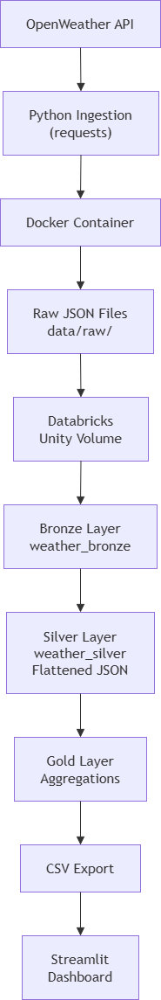
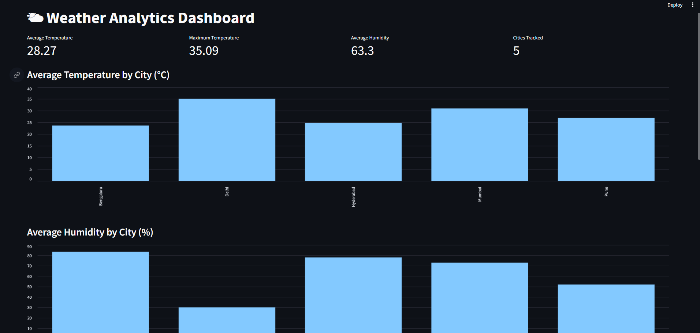

# Weather Data Engineering Pipeline

An end-to-end Weather Data Engineering Pipeline built using Python, Docker, Databricks, PySpark, Delta Lake, and Streamlit.

The pipeline ingests weather data from the OpenWeather API, processes it through a Medallion Architecture (Bronze, Silver, Gold), performs data quality checks, and serves analytical insights through an interactive Streamlit dashboard.

## Tech Stack

- Python
- Docker
- OpenWeather API
- Databricks
- PySpark
- Delta Lake
- Streamlit
- GitHub

## Pipeline Flow

OpenWeather API
→ Python Ingestion
→ Raw JSON Storage
→ Databricks Volume
→ Bronze Layer
→ Silver Layer
→ Gold Layer
→ CSV Export
→ Streamlit Dashboard

## Bronze Layer

Stores raw API responses without transformation.

## Silver Layer

- Flattens nested JSON
- Converts timestamps
- Standardizes schema

## Gold Layer

Business-ready aggregations:

- Average Temperature by City
- Average Humidity by City
- Maximum Temperature by City

## Data Quality

Implemented validation checks for:

- Temperature range validation
- Humidity range validation
- Null city validation

## Dashboard

## Future Enhancements

- Databricks Workflow Automation
- Auto Loader
- Kafka Streaming
- Airflow Orchestration
- Real-Time Weather Analytics